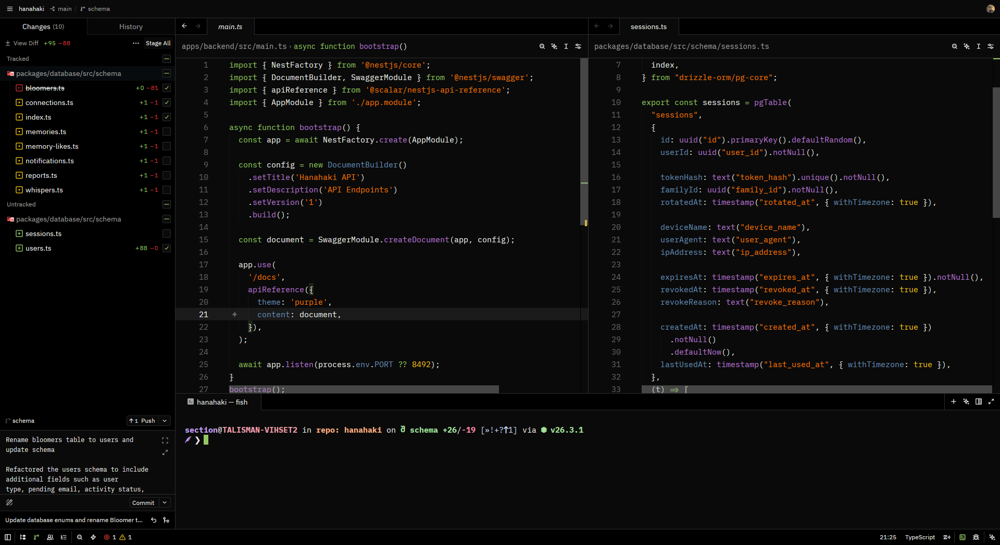
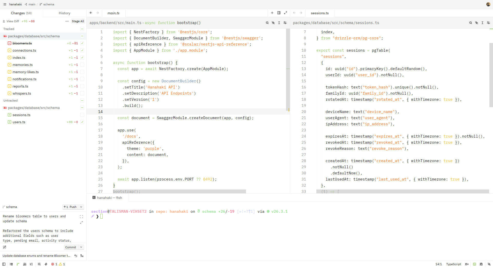

# Obsidian Theme for Zed

A Zed theme inspired by the [Obsidian theme for Notepad++](https://notepad-plus-plus.org/), [nickc01's VS Code port](https://github.com/nickc01/Obsidian-Theme-VSCode), and the [Vercel theme for Zed](https://github.com/NathanBrodin/zed-vercel-theme).

Includes **Obsidian Dark** and **Obsidian Light** variants with a signature green accent (`#93c763`), warm gold highlights, and a clean, high-contrast editing experience.

## Screenshots

### Obsidian Dark

<!-- Replace the placeholder below with your screenshot -->


### Obsidian Light

<!-- Replace the placeholder below with your screenshot -->


> **Adding screenshots:** Save your captures as `assets/obsidian-dark.png` and `assets/obsidian-light.png`. For best results, use a wide aspect ratio (e.g. 1920×1080) showing the editor with syntax highlighting, the sidebar, and the status bar.

## Features

- **Two appearances** — dark and light variants that share the same color language
- **Syntax highlighting** — keywords and constructors in green, functions in purple (dark) / neutral (light), strings in gold, types in blue
- **Terminal colors** — full ANSI palette tuned to match the editor
- **UI polish** — accent-colored focus borders, search match highlights, and version-control colors

## Color Palette

| Role | Dark | Light |
|------|------|-------|
| Background | `#0a0a0a` | `#f5f5f5` |
| Foreground | `#ededed` | `#171717` |
| Accent (keywords, links) | `#93c763` | `#93c763` |
| Functions | `#B477CF` | `#171717` |
| Strings / constants | `#efc210` | `#efc210` |
| Types / hints | `#678cb1` | `#678cb1` |
| Comments | `#666666` | `#999999` |

## Installation

### From the Zed Extension Gallery

Once published to the [Zed extension registry](https://github.com/zed-industries/extensions):

1. Open the Extensions panel (`Ctrl+Shift+X` / `Cmd+Shift+X`)
2. Search for **Obsidian Theme**
3. Click **Install**

### From source (dev extension)

1. Clone this repository:

   ```bash
   git clone https://github.com/SECT19N/zed-obsidian-theme.git
   cd zed-obsidian-theme
   ```

2. In Zed, open the Extensions panel (`Ctrl+Shift+X` / `Cmd+Shift+X`)
3. Click **Install Dev Extension**
4. Select the cloned `zed-obsidian-theme` directory

The theme loads immediately — no build step required.

## Usage

1. Open the command palette (`Ctrl+Shift+P` / `Cmd+Shift+P`)
2. Run **theme selector: toggle**
3. Choose **Obsidian Dark** or **Obsidian Light**

Zed will remember your selection across sessions.

## Project Structure

```
zed-obsidian-theme/
├── extension.toml      # Extension manifest
├── themes/
│   └── obsidian.json   # Theme definitions (dark + light)
├── assets/             # Screenshots (add your own)
│   ├── obsidian-dark.png
│   └── obsidian-light.png
└── LICENSE
```

## Credits

- [Obsidian Theme](https://github.com/nickc01/Obsidian-Theme-VSCode) by nickc01 — original color scheme
- [Vercel Theme for Zed](https://github.com/NathanBrodin/zed-vercel-theme) — structural inspiration for the Zed theme format

## License

[MIT](LICENSE) © 2026 [SECT19N](https://github.com/SECT19N)

## Contributing

Issues and pull requests are welcome. If you open a PR that changes colors, please include before/after screenshots in `assets/`.
